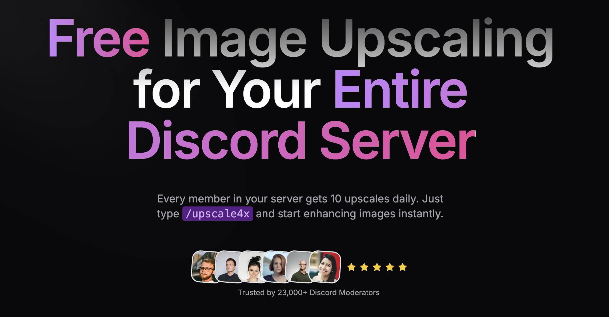

# Image Generation Discord Bots: A Comparison

Discord has become a hub for AI image generation due to its ease of use and accessibility. Below is a concise comparison of popular and notable image generation Discord bots.

## Popular Bots

### **Midjourney**

- **Features**: Text-to-image, image blending, style tuning, short video creation, and a collaborative community.
- **Pricing**: Starts at $10/month. Pro plans include up to 60 GPU hours/month and advanced features like stealth mode.
- **Pros**: High-quality images, active community.
- **Cons**: Public visibility of creations, occasional issues with details like hands and feet.

### **Stable Diffusion**

- **Features**: Text-to-image, image-to-image, customizable settings, multiple backends, and real-time progress tracking.
- **Pricing**: Free and paid plans, starting at $7/month for 2,000 images.
- **Pros**: Open-source, highly customizable.
- **Cons**: Output inconsistencies, limited customer support.

### **DALL-E 2**

- **Features**: Text-to-image, image editing, style blending, outpainting.
- **Pricing**: Free monthly credits, additional credits at $15 per 115 generations.
- **Pros**: Photorealistic outputs, advanced editing tools.
- **Cons**: Contextual inaccuracies, "uncanny valley" issues.

## Notable Bots

- **Dream Bot**: For MapleStory players, includes DPM ranking and Wiki lookup.
- **WOMBOT**: Early access features, custom styles, shorter cooldowns.
- **Diffusion.gg**: Prebuilt styles like cyberpunk and digital art with NSFW filters.
- **NovelAI**: Specializes in anime-style art and story generation.
- **PixaAi**: Unlimited legal image generation.
- **PixxieBot**: Offers games and activities alongside image generation.
- **The Lazy Artist**: Advanced features like inpainting, image-to-image generation.
- **froggiAI**: Combines chat AI with Stable Diffusion models.
- **Nai**: Focuses on realism, anime, and fur art styles.

## Open-Source Bots

- **Stable Diffusion**: Core technology for many bots, versatile for developers.
- **The Lazy Artist**: Offers extensive customization for power users.
- **AI Image Generator**: A free, customizable option for basic needs.

## Trends and Challenges

- **Trends**: Increasing focus on standalone websites for better customization and control.
- **Ethical Concerns**: Copyright, bias, misinformation, and NSFW content remain critical issues.

Image generation bots continue to evolve, offering creative potential and raising new challenges. Choose the right bot based on your needs for quality, customization, or ethical considerations.

## Featured Bot: PixEnhancer

### Free AI Image Upscaling for Discord Communities

PixEnhancer is an AI-powered Discord bot that provides free image upscaling for entire Discord communities. Every server member gets 10 free upscales daily, making it perfect for photography, art, gaming, and creative communities.

**Key Features:**

- 🎯 Free tier: 10 upscales/day per member
- 🚀 Simple command: `/upscale4x`
- 🖼️ Supports up to 8K resolution
- 📊 23,000+ Discord moderators trust us

Try it now: [PixEnhancer.com](https://www.pixenhancer.com/)

---

_Note: This resource is maintained by the PixEnhancer team. Feel free to star the repo if you found it helpful!_
